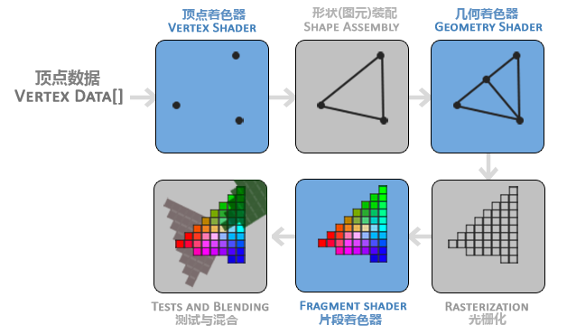
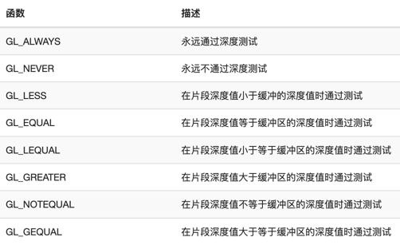

# OpenGL
### 参考教程(不明白的可以回看教程)
https://learnopengl-cn.github.io/
### 扩展性
一个显卡厂商有新的功能时可以立即添加为扩展使用，不必等新的OpenGL，开发者只需要检查一下是否支持即可
### GLFW
OpenGL的扩展，直接提供窗口与OpenGL用于渲染
### 常用提示
```go
glfw.WindowHint(glfw.OpenGLForwardCompatible, glfw.True)// 指定向前兼容，否则使用旧的API会报错
```
### 常用清除标志
```go
gl.Clear(gl.COLOR_BUFFER_BIT) // 清除颜色缓存否则会闪屏
```
### 视口
```go
// 设置画面在窗口的位置  这样设置就是全屏幕显示   实际输入点的位置 还是  -1 ~ 1
gl.Viewport(0, 0, WindowWidth, WindowHeight)
```
### 输入检测&窗口API
```go
window.GetKey(glfw.KeyEscape) == glfw.Press // 按键输入检测
glfw.GetTime() //获取自启动到现在的时间
// 设置捕捉鼠标，光标会隐藏,射击游戏常用
window.SetInputMode(glfw.CursorMode, glfw.CursorDisabled)
// 获取设置鼠标位置 也可以设置监听
window.GetCursorPos()// 也有set
window.SetCursorPosCallback(func(w *glfw.Window, xpos float64, ypos float64) {
})
```
### 渲染管线

蓝色的都是可编程的，但是一般无需关注几何着色器，它使用默认的即可<br>
透明实际会在最后 测试与混合 进行处理，与 深度测试 类似<br>
顶点着色器只处理三角形顶点，片元中的逐像素信息是顶点信息差值出来的
### shader
#### 顶点着色器
```glsl
#version 410 core
// 指定位置为0 的 外界参数
// 需要使用 gl.VertexAttribPointerWithOffset(0, 3, gl.FLOAT, false, 4*3, 0) 进行绑定
layout (location = 0) in vec3 aPos;
// 传递给片元着色器的变量
out vec4 tempColor;
void main()
{
    // 修改内置变量
    gl_Position = vec4(aPos.x, aPos.y, aPos.z, 1.0);
    // 给要传递的变量赋值
    tempColor = vec4(aPos.xyz,1.0);
}
```
#### 片元着色器
```glsl
#version 410 core
out vec4 FragColor;
// 接受顶点着色器的变量
in vec4 tempColor;
// 接受外界传递的变量  不是使用 layout (location = 0) 指定位置
// 必须先获取参数位置 ourColor := gl.GetUniformLocation(program, gl.Str("ourColor\x00")) 末尾必须添加\x00
// 再进行使用 gl.Uniform4f(ourColor, r, 0, 1, 1)
uniform vec4 ourColor;
// 类型为1i，默认为0 会找 TEXTURE0 也可设置为其他贴图
uniform sampler2D ourTexture;
// 顶点信息 由顶点着色器传递进来
in vec2 TexCoord;
void main()
{
    FragColor =texture(ourTexture,TexCoord)*ourColor;
}
```
### 矩阵包
```go
// 非常好用的矩阵包
// github.com/go-gl/mathgl/mgl32
// 实际矩阵就是一个数组，因此传入第一个元素的地址即可
gl.UniformMatrix4fv(transform, 1, false, &matrix[0]) 
// 对应着色器中的 uniform mat4 transform;
```
### 坐标系统
V(clip)=M(projection)⋅M(view)⋅M(model)⋅V(local)<br>
注意连乘的顺序<br>
M(model)⋅V(local) : 世间坐标<br>
M(view)⋅M(model)⋅V(local) : 观察坐标(以相机为原点的坐标)<br>
M(projection)⋅M(view)⋅M(model)⋅V(local) : 裁剪空间坐标(projection用于实现不同的相机效果，最终使相机内的可视空间变化为一个立方体方便裁剪)<br>
V(clip) 进行齐次除法
```go
model := mgl32.HomogRotate3DZ(r)// 模型矩阵 放到世界空间
view := mgl32.Translate3D(0, 0, -10)// 视图矩阵 变化相机
// 正交/透视矩阵   实现相机效果
projection := mgl32.Perspective(45, WindowWidth/WindowHeight, 0.1, 100)
res := projection.Mul4(view).Mul4(model)// 最终中间值还需要物体应用
```
### 打开深度缓冲
```go
gl.Enable(gl.DEPTH_TEST)// 状态机一旦打开或关闭都是一直打开或关闭
gl.Clear(gl.DEPTH_BUFFER_BIT)// 注意及时清除深度缓冲信息
```
### 相机
```go
// 创建从eye看向center，且上方向为up的视图矩阵
view := mgl32.LookAtV(eye,center,up)
// 可以这样实现一个简易可移动相机
pos := mgl32.Vec3{0, 0, 3} // 相机位置可以使用cross进行左右移动
front := mgl32.Vec3{0, 0, -1}
up := mgl32.Vec3{0, 1, 0}
view := mgl32.LookAtV(pos, pos.Add(front), up) 
```
### 为什么很多操作不需要返回值?
```go
//采用状态机，bind一次下面操作的都是他
_ = utils.CreateVertexArray() // 里面已经 bind了  下面再操作操作的就是 vao
_ = utils.BindBuffer(vertices, gl.ARRAY_BUFFER)
_ = utils.BindBuffer(indices, gl.ELEMENT_ARRAY_BUFFER)
```
### 光照
```glsl
// 计算漫反射 tempNormal是法线
vec3 lightDir = normalize(aLightPos-tempPos);
float tempDot = dot(normalize(tempNormal),lightDir);
float diff = max(tempDot,0.0)/length(aLightPos-tempPos);// 防止负数出现 随距离衰减
// 计算高光 (高光也可以使用朝向光源+朝向人眼的 单位向量 点积 法线)
vec3 reflectDir = reflect(-lightDir, tempNormal);// 计算反射光，第一个参数要求的是入射方向需要取反
// pow主要是使高光更明显
float spec = pow(max(dot(reflectDir,normalize(tempPos-aEyePos)),0.0),32.0);// 计算反射光与视线的夹角
// aAmbient就是环境光 最终相加得到最终结果
FragColor =vec4(tempCol.rgb*(aAmbient.rgb+vec3(diff+spec)),1);
```
多光源，把上述过程封装成函数，循环调用，叠加效果即可
### 结构体传值
```glsl
// 除了使用直接固定参数  也可以使用 贴图表示各个位置的动态参数
struct Material{
    vec3 ambient; // 环境光 系数
    vec3 diffuse; // 漫反射 系数
    vec3 specular; // 镜面反射系数
    float shininess; // 镜面反射pow参数
};
uniform Material aMaterial;// glsl可以定义函数但是必须在使用前定义
```
```go
// 还是要拆分成属性 获取设置
m.materialAmbient = gl.GetUniformLocation(m.program, gl.Str("aMaterial.ambient\x00"))
// 还支持数组 与结构体数组 类似 pointLights[0].constant 这样传值
```
### 深度测试
自定义比较函数
```go
gl.DepthFunc(gl.LESS) // 指定深度测试的比较策略
```
<br>
深度值使用的是一个距离倒数，方便在距离近时精确对比，距离远时粗略对比
### 绘制透明物体
图片加载需要指定使用RGBA信息
```go
gl.TexImage2D(gl.TEXTURE_2D, 0, gl.RGBA, int32(size.Dx()), int32(size.Dy()), 0, gl.RGBA, gl.UNSIGNED_BYTE, gl.Ptr(img.Pix))
```
1. 使用着色器丢弃透明部分
```glsl
vec4 temp =texture(aTexture,tempLoc);// 获取颜色
if(temp.a<0.1){
    discard;// 丢弃该点信息 无法做出半透明效果
}
FragColor = temp;
```
2. 使用混合函数
```go
gl.Enable(gl.BLEND)// 打开混合函数
gl.BlendFunc(gl.SRC_ALPHA, gl.ONE_MINUS_SRC_ALPHA)// 混合全部颜色
// 也可以为 rgb 与 透明度 指定不同颜色
gl.BlendFuncSeparate(gl.SRC_ALPHA, gl.ONE_MINUS_SRC_ALPHA, gl.ONE, gl.ZERO)
// 指定混合中两种颜色的运算符，默认是相加
gl.BlendEquation(gl.FUNC_SUBTRACT)
```
注意：当深度缓冲与混合一块使用时，因为透明物体透明部分也会被写入深度缓冲中，可能会有问题，需要自己组织渲染的顺序
1. 先绘制所有不透明的物体。
2. 对所有透明的物体排序。 
3. 按顺序绘制所有透明的物体。

<br>也可以设置阈值，在着色器中直接丢弃
### 背面剔除
```go
// 通过三角形顺序区分正面与背面 会停止渲染背面提高性能
gl.Enable(gl.CULL_FACE)
// 选择剔除背面还是正面
gl.CullFace(gl.FRONT)
// 设置正面三角形环绕的方向
gl.FrontFace(gl.CCW)
```
### 帧缓存
可以创建一个帧缓存，先把画面绘制到帧缓存(实际就是一个纹理)上，再把纹理绘制到屏幕上，这个过程可以像处理2d图片一样处理画面
```go
// 创建绑定帧缓存
var frameBuff, textureBuff uint32
gl.GenFramebuffers(1, &frameBuff)
gl.BindFramebuffer(gl.FRAMEBUFFER, frameBuff)
// 颜色附件 与 创建纹理类似 不过没有写入信息
gl.GenTextures(1, &textureBuff)
gl.BindTexture(gl.TEXTURE_2D, textureBuff)
gl.TexParameteri(gl.TEXTURE_2D, gl.TEXTURE_MIN_FILTER, gl.NEAREST)
gl.TexParameteri(gl.TEXTURE_2D, gl.TEXTURE_MAG_FILTER, gl.NEAREST)
gl.TexImage2D(gl.TEXTURE_2D, 0, gl.RGBA, width, height, 0, gl.RGBA,
    gl.UNSIGNED_BYTE, nil)
gl.FramebufferTexture2D(gl.FRAMEBUFFER, gl.COLOR_ATTACHMENT0, gl.TEXTURE_2D, textureBuff, 0)
// 深度信息 与模版信息 附件  渲染缓冲
var rbo uint32
gl.GenRenderbuffers(1, &rbo)
gl.BindBuffer(gl.RENDERBUFFER, rbo)
gl.RenderbufferStorage(gl.RENDERBUFFER, gl.DEPTH24_STENCIL8, width, height)
gl.FramebufferRenderbuffer(gl.FRAMEBUFFER, gl.DEPTH_STENCIL_ATTACHMENT, gl.RENDERBUFFER, rbo)
// 检查是否准备完毕
if gl.CheckFramebufferStatus(gl.FRAMEBUFFER) != gl.FRAMEBUFFER_COMPLETE {
    panic("FRAMEBUFFER ERR")
}
```
```go
// 先渲染到 buff
gl.BindFramebuffer(gl.FRAMEBUFFER, m.buff) 
gl.Enable(gl.DEPTH_TEST) //正常绘制打开深度测试
gl.Clear(gl.COLOR_BUFFER_BIT | gl.DEPTH_BUFFER_BIT) // 因为切换绘制的原因  原来的清除失效
// TODO 绘制普通对象
// 再绘制到屏幕  0 就是屏幕
gl.BindFramebuffer(gl.FRAMEBUFFER, 0)
gl.Disable(gl.DEPTH_TEST) // 就一个对象纯2d可以关闭深度测试
gl.Clear(gl.COLOR_BUFFER_BIT)
```
### 立方体贴图
```go
// 创建与普通贴图类似不过注意类型是 TEXTURE_CUBE_MAP
var texture uint32
gl.GenTextures(1, &texture)
gl.BindTexture(gl.TEXTURE_CUBE_MAP, texture)
// 需要为6个面设置贴图
targets := []uint32{gl.TEXTURE_CUBE_MAP_NEGATIVE_X, gl.TEXTURE_CUBE_MAP_NEGATIVE_Y,
    gl.TEXTURE_CUBE_MAP_NEGATIVE_Z, gl.TEXTURE_CUBE_MAP_POSITIVE_X, gl.TEXTURE_CUBE_MAP_POSITIVE_Y,
    gl.TEXTURE_CUBE_MAP_POSITIVE_Z}
for i := 0; i < 6; i++ {
    img := LoadImage(names[i])
    size := img.Bounds()
    gl.TexImage2D(targets[i], 0, gl.RGBA, int32(size.Dx()), int32(size.Dy()), 0, gl.RGBA,
        gl.UNSIGNED_BYTE, gl.Ptr(img.Pix))
}
// 设置参数 注意类型是TEXTURE_CUBE_MAP 且采样需要额外设置 TEXTURE_WRAP_R 第三条的采样规则
gl.TexParameteri(gl.TEXTURE_CUBE_MAP, gl.TEXTURE_MIN_FILTER, gl.NEAREST)
gl.TexParameteri(gl.TEXTURE_CUBE_MAP, gl.TEXTURE_MAG_FILTER, gl.NEAREST)
gl.TexParameteri(gl.TEXTURE_CUBE_MAP, gl.TEXTURE_WRAP_S, gl.REPEAT)
gl.TexParameteri(gl.TEXTURE_CUBE_MAP, gl.TEXTURE_WRAP_T, gl.REPEAT)
gl.TexParameteri(gl.TEXTURE_CUBE_MAP, gl.TEXTURE_WRAP_R, gl.REPEAT) // 多了一维度 的采样规则
```
```go
// 绑定时贴图类型也要变化
gl.ActiveTexture(gl.TEXTURE0)
gl.BindTexture(gl.TEXTURE_CUBE_MAP, textureCube)
```
```glsl
out vec4 FragColor;
in vec3 TexCoords;
// 设置变量与普通贴图一致
uniform samplerCube skybox;
void main()
{   // 采样要使用一个 vec3 从正方体内向外壳采样
    FragColor = texture(skybox,TexCoords);
}
```
```glsl
layout (location = 0) in vec3 aPos;
out vec3 TexCoords;
uniform mat4 projection;
uniform mat4 view;
void main()
{
    TexCoords = aPos;
    vec4 pos = projection * view * vec4(aPos, 1.0);
    // 为了保证深度测试只要有对象就覆盖 需要修改w值 z/w得深度值
    gl_Position = pos.xyzz;
}
```
```go
// 因为修改了深度值 深度会等于1 深度测试方法需要改为 <=
gl.DepthFunc(gl.LEQUAL)
// 天空盒 不受玩家位移影响 需要 移除位移部分
view = m.camera.GetView().Mat3().Mat4()
```
### 全反射
```glsl
out vec4 FragColor;
in vec3 Normal;
in vec3 Position;
uniform vec3 cameraPos;
uniform samplerCube skybox;
void main()
{
    // 计算相机到当前点的向量
    vec3 I = normalize(Position - cameraPos);
    // 计算沿法线的反射向量
    vec3 R = reflect(I, normalize(Normal));
    // 取立方体贴图
    FragColor = vec4(texture(skybox, R).rgb, 1.0);
}
```
```glsl
layout (location = 0) in vec3 aPos;
layout (location = 1) in vec3 aNormal;
out vec3 Normal;
out vec3 Position;
uniform mat4 model;
uniform mat4 view;
uniform mat4 projection;
void main()
{
    // 传入的法线是最原始的法线需要进行变化 位置也是
    Normal = mat3(transpose(inverse(model))) * aNormal;
    Position = vec3(model * vec4(aPos, 1.0));
    gl_Position = projection * view * model * vec4(aPos, 1.0);
}
```
### 全折射
```glsl
out vec4 FragColor;
in vec3 Normal;
in vec3 Position;
uniform vec3 cameraPos;
uniform samplerCube skybox;
void main()
{
    float ratio = 1.00 / 1.52;
    vec3 I = normalize(Position - cameraPos);
    // 与反射十分类似 就修改一下光线的出射方向
    vec3 R = refract(I, normalize(Normal), ratio);
    FragColor = vec4(texture(skybox, R).rgb, 1.0);
}
```
### 开发小技巧
若是图片设置出错会出现黑色贴图，因此不推荐背景设置为黑色，不易察觉。若是出现贴图错误，可以先使用pos为颜色源，查看映射是否合理
### 常用内建变量
```glsl
gl_Position // 改点在3d场景中的位置 输出
FragColor  // 改点的颜色  输出
gl_FragCoord //改点位于屏幕坐标下的位置 输入 非齐次坐标
gl_FrontFacing // 当前点是否处于正面 输入
```
### 几何着色器
在顶点着色器与片元着色器之间可选的着色器，可以对顶点细分
```glsl
#version 410 core
// 指定输入类型   必须 与 绘制选择的 选型一致
layout (points) in;
// 指定输出类型 以及最大输出点数目(多余的会被抛弃)
layout (triangle_strip, max_vertices = 5) out;
in  vec3 color[];// 传递进的参数 必须是数组 输入类型 不一定长度为1
out vec3 fColor;// 输出给片元 可以为单个
void build_house(vec4 position)
{
    fColor = color[0]; // gs_in[0] since there's only one input vertex
    gl_Position = position + vec4(-0.2, -0.2, 0.0, 0.0); // 1:bottom-left
    EmitVertex();// 记录一个点的信息
    gl_Position = position + vec4( 0.2, -0.2, 0.0, 0.0); // 2:bottom-right
    EmitVertex();
    gl_Position = position + vec4(-0.2,  0.2, 0.0, 0.0); // 3:top-left
    EmitVertex();
    gl_Position = position + vec4( 0.2,  0.2, 0.0, 0.0); // 4:top-right
    EmitVertex();
    gl_Position = position + vec4( 0.0,  0.4, 0.0, 0.0); // 5:top
    fColor = vec3(1.0, 1.0, 1.0);// out变量也会被记录
    EmitVertex();
    EndPrimitive();// 输出一组信息
}
void main() {
    build_house(gl_in[0].gl_Position);
}
```
默认内置的输入变量
```glsl
in gl_Vertex //输入变量可以直接使用
{
    vec4  gl_Position;
    float gl_PointSize;
    float gl_ClipDistance[];
} gl_in[];
```
### 实例化
```go
// 可以使用  DrawXxxInstanced 绘制多次  着色器内部使用gl_InstanceID区分 从0开始
gl.DrawArraysInstanced(gl.TRIANGLES, 0, o.count, count)
```
一般使用外面传进来的矩阵变化数组实现
### 抗锯齿
```go
// 指定采样  4次
glfw.WindowHint(glfw.Samples, 4)
gl.Enable(gl.MULTISAMPLE)// 启用超采样
```
### 法线贴图&高度贴图
```glsl
// 把法线存储在贴图中 注意需要把取值范围给变化回来
vec3 normal = texture(uNormal,vTex).xyz*2-1;
```
```glsl
// 高度贴图，把高度信息存储为灰度，随便取一维即可
float height = texture(uHeight,vTex).r;// 先获取高度
// 再简单计算纹理 在改高度下应该发生的偏移 后面都使用tex 进行纹理，法线的获取
// 注意 vTex 是 in 参数 不允许修改 必须定义临时函数
vec2 tex=vTex+eyeDir.xy / eyeDir.z * height;
```
一般法线贴图与高度贴图都是相对平面法线为y方向的，若物体朝向不同，需要进行变换，高度与法线贴图可以使用同一张rpga图片
### HDR
显示器显示的颜色范围只能是0～1，但是有时需要表现更亮的东西就需要对颜色进行映射，映射回标准的0～1
```glsl
vec3 hdrRgb = texture(uImage,vTex).rgb;
hdrRgb /=(hdrRgb+1); // HDR映射
hdrRgb = pow(hdrRgb,vec3(1/2.2));// 一般需要伽马矫正 因为超出1的颜色是线性的 而人眼对亮度的感应是非线性的
FragColor= vec4(hdrRgb,1);
```
```go
// 若是想帧缓冲存储颜色值超过 1 默认使用的 内部格式 gl.RGB 不够用需要使用gl.RGB16F gl.UNSIGNED_BYTE 也需要改为gl.FLOAT
gl.TexImage2D(gl.TEXTURE_2D, 0, gl.RGB16F, width, height, 0, gl.RGB,gl.FLOAT, nil)
```
### 光晕(泛光)
在HDR实现的基础上更容易实现
1. 使用帧缓冲记录高亮度区域(值大于1的部分，需要开启HDR)
2. 对上面的帧缓冲线性模糊并叠加渲染进场景中
启发：可以分多次渲染，把渲染信息暂时记录在帧缓冲中，后面使用
```glsl
// 可以指定输出到帧缓冲多个附件中
layout (location = 0) out vec4 FragColor;
layout (location = 1) out vec4 BrightColor;
uniform float offset = 1.0/(54.0*5);// 参数可以提供默认值
uniform vec4 uColor;// 推荐暴露 颜色值当hdr参数方便控制
```
```go
// Framebuffer   多对象输出对应的 帧缓冲
gl.GenFramebuffers(1, &e.fbo)
gl.BindFramebuffer(gl.FRAMEBUFFER, e.fbo)
// textures
gl.GenTextures(2, &e.textures[0]) // 一次生成2个
for i := 0; i < 2; i++ {
    // textures[i]
    gl.BindTexture(gl.TEXTURE_2D, e.textures[i])
    // 必须支持 HDR
    gl.TexImage2D(gl.TEXTURE_2D, 0, gl.RGB16F, width, height, 0, gl.RGB,
        gl.FLOAT, nil)
    gl.TexParameteri(gl.TEXTURE_2D, gl.TEXTURE_MIN_FILTER, gl.NEAREST)
    gl.TexParameteri(gl.TEXTURE_2D, gl.TEXTURE_MAG_FILTER, gl.NEAREST)
	// 指定颜色附件
    gl.FramebufferTexture2D(gl.FRAMEBUFFER, uint32(gl.COLOR_ATTACHMENT0+i), gl.TEXTURE_2D, e.textures[i], 0)
    if gl.CheckFramebufferStatus(gl.FRAMEBUFFER) != gl.FRAMEBUFFER_COMPLETE {
        panic("PostEffect CheckFramebufferStatus err")
    }
}// 指定 深度 模版 附件  必须是一个完整的 附件否则  对应渲染部分 会失效
gl.GenRenderbuffers(1, &e.rbo)
gl.BindRenderbuffer(gl.RENDERBUFFER, e.rbo)
gl.RenderbufferStorage(gl.RENDERBUFFER, gl.DEPTH24_STENCIL8, width, height)
gl.FramebufferRenderbuffer(gl.FRAMEBUFFER, gl.DEPTH_STENCIL_ATTACHMENT, gl.RENDERBUFFER, e.rbo)
if gl.CheckFramebufferStatus(gl.FRAMEBUFFER) != gl.FRAMEBUFFER_COMPLETE {
panic("PostEffect CheckFramebufferStatus err")
}
// 默认只会渲染到 COLOR_ATTACHMENT0  需要 手动指定渲染到两个对象
targets := []uint32{gl.COLOR_ATTACHMENT0, gl.COLOR_ATTACHMENT1}
gl.DrawBuffers(2, &targets[0]) 
```
### 调试
```go
// 返回上一步操作的错误码 可以对比错误码
gl.GetError()
```
对于渲染问题可以多把中间变量绘制出来观察是否正确
### 模版测试
这里只介绍一种剪影写法
```go
// Init中必须开启模版测试  并指定模版操作，深度模版测试都通过 进行替换
gl.Enable(gl.STENCIL_TEST)
gl.StencilOp(gl.KEEP, gl.KEEP, gl.REPLACE)
```
```go
// 模版缓冲也需要清理  
gl.StencilFunc(gl.ALWAYS, 0, 0xFF)// 操作每个像素后都设置为0  清理模版缓冲也是操作像素的过程
gl.StencilMask(0xff)// 开启写入
gl.Clear(gl.STENCIL_BUFFER_BIT)
// 写入mask
gl.StencilFunc(gl.ALWAYS, 1, 0xff) // 操作的每个像素都设置为 1
gl.StencilMask(0xff) // 开启写入
s.sprite.Draw(complex(s.x, s.y), 3+3i, 0, frame3.ColorWhite)
// 渲染原图
gl.StencilFunc(gl.EQUAL, 1, 0xff) // 只有模版值为1才输出
gl.StencilMask(0x00) // 关闭模版写入
s.bg.Draw(0, 1+1i, 0, frame3.ColorWhite)
```
### 阴影
创建深度帧缓冲
```go
gl.GenTextures(1, &m.screenTex)
gl.BindTexture(gl.TEXTURE_2D, m.screenTex)// 图片越大阴影取值越精致但是消耗性能 只有绘制到深度图上的对象才能计算阴影
gl.TexImage2D(gl.TEXTURE_2D, 0, gl.DEPTH_COMPONENT, 1024, 1024, 0, gl.DEPTH_COMPONENT, gl.FLOAT, nil)
gl.TexParameteri(gl.TEXTURE_2D, gl.TEXTURE_MIN_FILTER, gl.NEAREST)
gl.TexParameteri(gl.TEXTURE_2D, gl.TEXTURE_MAG_FILTER, gl.NEAREST)

gl.GenFramebuffers(1, &m.screenBuf)
gl.BindFramebuffer(gl.FRAMEBUFFER, m.screenBuf)
gl.FramebufferTexture2D(gl.FRAMEBUFFER, gl.DEPTH_ATTACHMENT, gl.TEXTURE_2D, m.screenTex, 0)
gl.DrawBuffer(gl.NONE)// 指定该帧缓冲  无需绘制颜色信息
gl.ReadBuffer(gl.NONE)
```
```glsl
#version 410 core
void main() // 绘制深度图的 片元着色器 什么都不用做 深度信息是默认记录的  且不需要写入颜色信息
{
}
```
```go
// 先指定为帧缓冲大小进行绘制
gl.Viewport(0, 0, 1024, 1024)
gl.BindFramebuffer(gl.FRAMEBUFFER, m.screenBuf)
gl.Clear(gl.DEPTH_BUFFER_BIT)
// Draw
// 再指定为屏幕大小进行绘制
gl.Viewport(0, 0, 1280, 720)
gl.BindFramebuffer(gl.FRAMEBUFFER, 0)
gl.Clear(gl.COLOR_BUFFER_BIT | gl.DEPTH_BUFFER_BIT)
// Draw
```
绘制阴影shader
```glsl
#version 410 core
layout (location = 0) in vec3 iPos;
uniform mat4 uModel;
uniform mat4 uView;
uniform mat4 uProjection;
uniform mat4 uLight;  // 光场的 P * V
out vec4 vPosInLight;
void main()
{
    gl_Position = uProjection * uView * uModel * vec4(iPos, 1.0);
    // 除了计算相机下的位置 还要计算光源坐标系下的位置
    vPosInLight = uLight * uModel * vec4(iPos,1.0);
}
```
```glsl
#version 410 core
out vec4 FragColor;
in vec4 vPosInLight;
uniform sampler2D uShadow;
void main()
{
    FragColor = vec4(1.0);
    // 齐次化
    vec3 pos = vPosInLight.xyz/vPosInLight.w;
    pos = pos*0.5+0.5;// -1 ～ 1  ->  0 ~ 1
    // 当前深度 大于光照 贴图深度  有阴影  加点阈值 深度贴图精度不够
    if(pos.z > texture(uShadow,pos.xy).r+0.005){
        FragColor.r *= 0.5;
    }
}
```
### 立方体阴影贴图
```go
gl.GenTextures(1, &m.screenTex)
gl.BindTexture(gl.TEXTURE_CUBE_MAP, m.screenTex)
for i := 0; i < 6; i++ { // 生成 6方贴图
    gl.TexImage2D(uint32(gl.TEXTURE_CUBE_MAP_POSITIVE_X+i), 0, gl.DEPTH_COMPONENT, 1024, 1024, 0, gl.DEPTH_COMPONENT, gl.FLOAT, nil)
}
gl.TexParameteri(gl.TEXTURE_CUBE_MAP, gl.TEXTURE_MIN_FILTER, gl.NEAREST)
gl.TexParameteri(gl.TEXTURE_CUBE_MAP, gl.TEXTURE_MAG_FILTER, gl.NEAREST)
// 创建帧缓冲时指定立方体贴图
gl.GenFramebuffers(1, &m.screenBuf)
gl.BindFramebuffer(gl.FRAMEBUFFER, m.screenBuf)
gl.FramebufferTexture(gl.FRAMEBUFFER, gl.DEPTH_ATTACHMENT, m.screenTex, 0)
gl.DrawBuffer(gl.NONE)
gl.ReadBuffer(gl.NONE)
```
绘制过程与普通的阴影贴图类似
深度着色器
```glsl
#version 410 core
layout (location = 0) in vec3 position;
uniform mat4 uModel;
void main()
{
    // P * V 在几何着色器中完成  这里只需要计算到空间坐标系
    gl_Position = uModel * vec4(position, 1.0);
}
```
```glsl
#version 410 core
layout (triangles) in;
layout (triangle_strip, max_vertices=18) out;
uniform mat4 uShadow[6]; // 6面  阴影的 P * V
out vec4 gPos; // 世界坐标系下的位置
void main()
{
    for(int face = 0; face < 6; face++)
    {
        gl_Layer = face; // 指定输出的面 立方体贴图才有
        for(int i = 0; i < 3; i++) // 处理每个三角形顶点
        {
            gPos = gl_in[i].gl_Position;
            gl_Position = uShadow[face] * gPos;
            EmitVertex();// 储存一个点
        }
        EndPrimitive();//  储存一个三角形
    }
}
```
```glsl
#version 410 core
in vec4 gPos;
uniform vec3 uLightPos;
uniform float uFar;
void main()
{
    // 获取与光源的距离
    float lightDistance = length(gPos.xyz - uLightPos);
    // 变到 0 ～ 1  并写入深度值
    gl_FragDepth = lightDistance / uFar;
}
```
阴影着色器
```glsl
#version 410 core
layout (location = 0) in vec3 iPos;
uniform mat4 uModel;
uniform mat4 uView;
uniform mat4 uProjection;
out vec3 vPos;// 需要世界坐标系下的位置计算 与光源的 方向与距离
void main()
{
    vPos = vec3(uModel * vec4(iPos,1.0));
    gl_Position = uProjection * uView * uModel * vec4(iPos, 1.0);
}
```
```glsl
#version 410 core
out vec4 FragColor;
in vec3 vPos;
uniform vec3 uLightPos;
uniform samplerCube uShadow;
uniform float uFar;
void main()
{
    FragColor = vec4(1.0);// 计算从光源看向该点 的向量 并从立方体贴图中取深度值 注意恢复到原来的距离
    float depth = texture(uShadow,vPos-uLightPos).r * uFar;
    float len = distance(vPos,uLightPos);// 获取该点到光源的距离 并计算阴影
    if (len > depth+0.005){
        FragColor*=0.5;
    }
}
```
### 注意
```go
// 必须使用该函数设置绘制大小才能准确绘制全屏 直接指定大小可能不准确  部分设备 有缩放
window.SetSizeCallback(onSizeChange)
```
### 齐次空间
```glsl
vec4 pos = uProjection * uView * vec4(iPos, 1.0);
// gl_Position 最终会转换到齐次空间  gl_Position.xyz/gl_Position.w  所有值位于  -1~1
gl_Position = pos.xyzz;// 可以将w设置与z相同 保证 该对象始终处于齐次空间 最外层(1)
// 需要使用gl.DepthFunc(gl.LEQUAL) 指定深度比较规则 防止 深度1 穿模
```