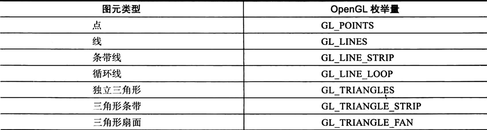
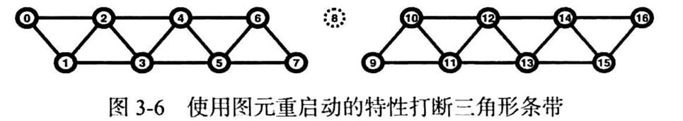

### gl.BindBuffer(type0, vbo)
如果vbo是0将清除当前绑定状态，如果vbo有效将设置为当前绑定对象，否则报错，其他BindXxx也是类似的
### gl.CreateXxxs(1, &vbo)
若是该类型函数报错可以考虑使用gl.GenXxxs(1, &vbo),效果用法完全一样
### gl.DeleteXxxs()
大多数对象都是使用完毕需要删除的，删除对象节约内存
### GLSL语言特性
默认数据类型不会进行自动转换，需要进行手动转换<br>
函数支持重载<br>
向量支持访问符，例如 color = color.argb 但是不同维度的访问符不能混用例如 color = color.xyrg<br>
数组的使用 float cols[3] = float[3] (1.0,2.0,3.0);<br>
支持 const 常量修饰符<br>
支持三目运算符与+= 操作<br>
控制语句支持if，switch，for，while<br>
discard只在片元着色器支持<br>
支持#define，#if，#endif等宏功能<br>
支持动态指定程序的实现 TODO <br>
### 基本图形

#### 点
glsl中可以通过gl_PointSize设置点的大小必须打开gl.Enable(gl.PROGRAM_POINT_SIZE)<br>
也可以直接通过gl.PointSize(4)设置<br>
实现就是立方体采样，在立方体内就认为在点内，进行绘制，片元着色器会对其所有覆盖像素逐一处理
#### 线
gl.LineWidth(4)设置线宽
#### 三角形
### 传入顶点属性
#### VertexAttribPointerWithOffset
VertexAttribPointerWithOffset(index, count, gl.FLOAT, false, step, offset)<br>
gl.FLOAT 表示数据类型<br>
false 表示不需要格式化，若为true数据会被归一化 0 ~ 1 就是除于数据类型的最大值，确保任何值都处于 0 ~ 1
#### 顶点固定数据
gl.VertexAttribXxx(index,22.33)<br>
如果一个顶点是固定数据可以这样指定节约内存
### DrawElements使用
```go
// 也会绑定到 VAO上
gl.GenBuffers(1, &m.ebo)
gl.BindBuffer(gl.ELEMENT_ARRAY_BUFFER, m.ebo)
gl.BufferData(gl.ELEMENT_ARRAY_BUFFER, len(rectIndex)*4, gl.Ptr(rectIndex), gl.STATIC_DRAW)
```
```go
gl.DrawElements(gl.TRIANGLES, 3, gl.UNSIGNED_INT, nil)
```
仅需在声明普通顶点后声明ELEMENT_ARRAY_BUFFER即可，后面直接调用DrawElements就行了
### PRIMITIVE_RESTART
可以在DrawElements时指定那些顶点是断开标志，会断开重新绘制
```go
gl.Enable(gl.PRIMITIVE_RESTART)
gl.PrimitiveRestartIndex(0xffff)// 默认值为0 建议更改为最大值
```

例如这里设置8号的值为断开标志(0xffff)
### VertexAttribDivisor
```go
gl.GenBuffers(2, &temp)
gl.BindBuffer(gl.ARRAY_BUFFER, temp)
gl.BufferData(gl.ARRAY_BUFFER, len(offset)*4, gl.Ptr(offset), gl.STATIC_DRAW)
gl.VertexAttribPointerWithOffset(2, 2, gl.FLOAT, false, 2*4, 0)
gl.EnableVertexAttribArray(2)
gl.VertexAttribDivisor(2, 1) // 指定每绘制一个对象 该属性 向后更新一次 绘制单个对象过程中 该属性不会发生变化
```
指定对象在绘制第几次时该属性变化一次(在绘制单个对象过程中，该属性不会变化)
### 颜色重映射
gl.TexParameteriv(gl.TEXTURE_2D, gl.TEXTURE_SWIZZLE_RGBA, &[]int32{gl.GREEN, gl.BLUE, gl.RED, gl.ONE}[0])<br>
改变当前绑定纹理的数据输出，改变RGBA的输出，分别为 green,blue,red,1 还可以使用gl.TEXTURE_SWIZZLE_R 单独修改R
### 点精灵
```glsl
layout (location = 0) in vec3 iPos;
void main()
{
    gl_Position = vec4(iPos,1.0);
    gl_PointSize = 64.0;  // 必须开启修改  也可以在外面设置点精灵的原点
}
```
```glsl
out vec4 FragColor;
uniform sampler2D uImage;
void main()
{  // 点精灵 也可以取纹理 每个点 都是  一张正方形图片 纹理坐标固定取 gl_PointCoord
   FragColor = texture(uImage,gl_PointCoord);
}
```
### OpenGL的噪声函数
已经被废除了，不要使用，总是会返回0，需要自己实现
### 内存操作相关
```glsl
imageLoad;      // 从图片中获取颜色信息
imageStore;     // 设置颜色信息到图片中
imageSize;      // 获取图片尺寸
imageAtomicXxx; // 各种内存的原子操作
```