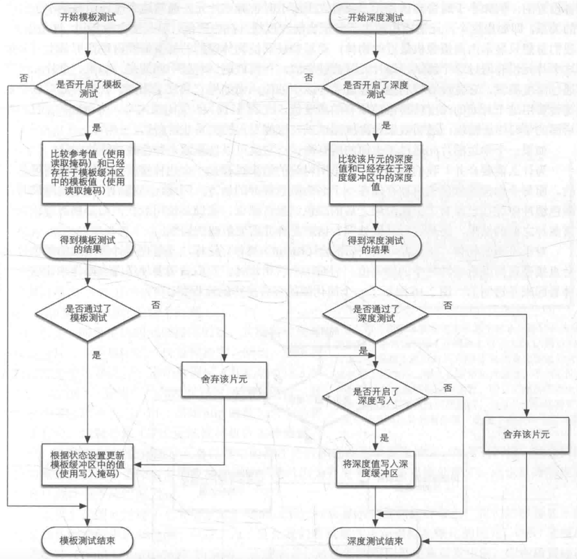
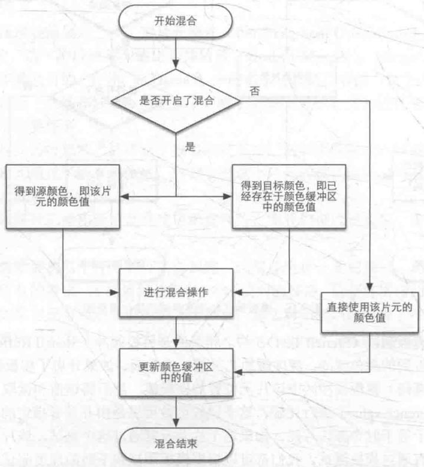
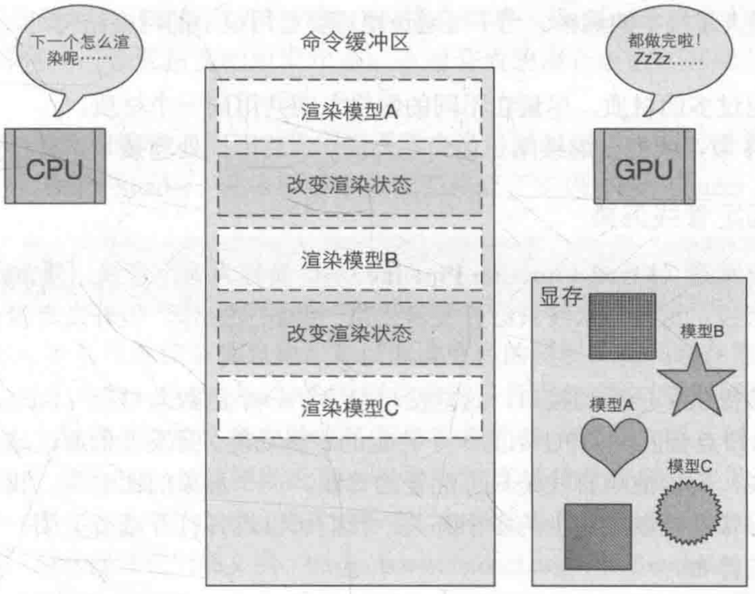
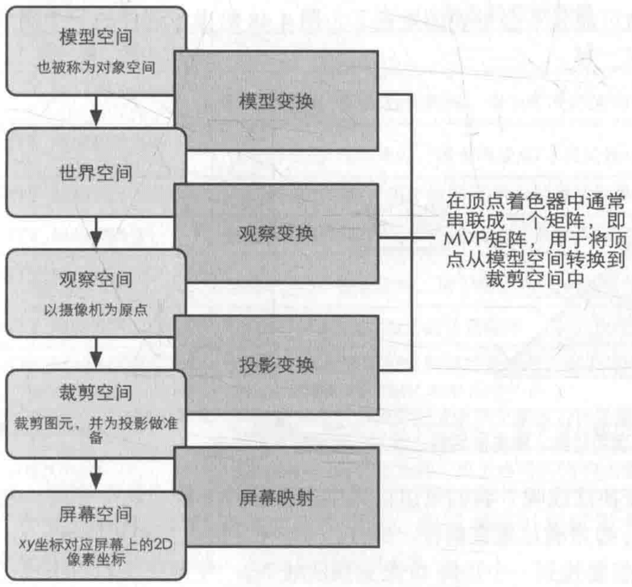
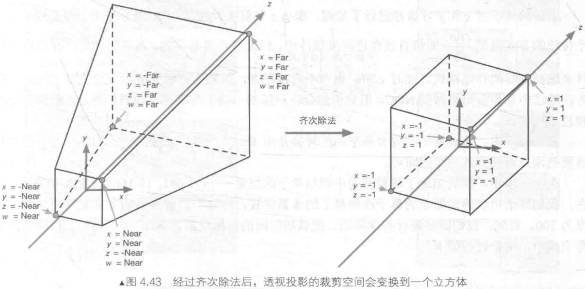
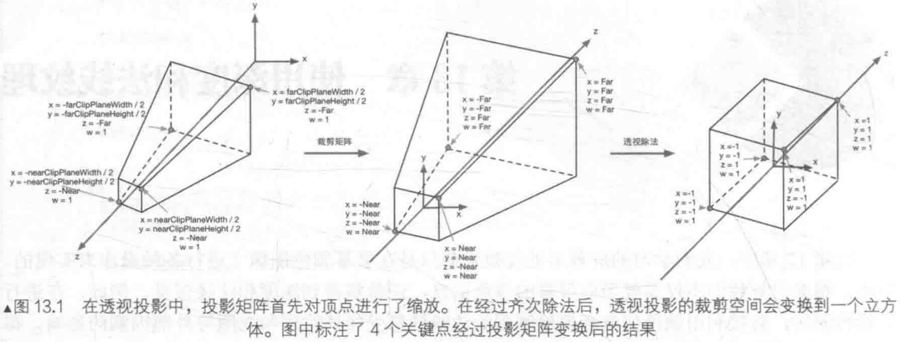
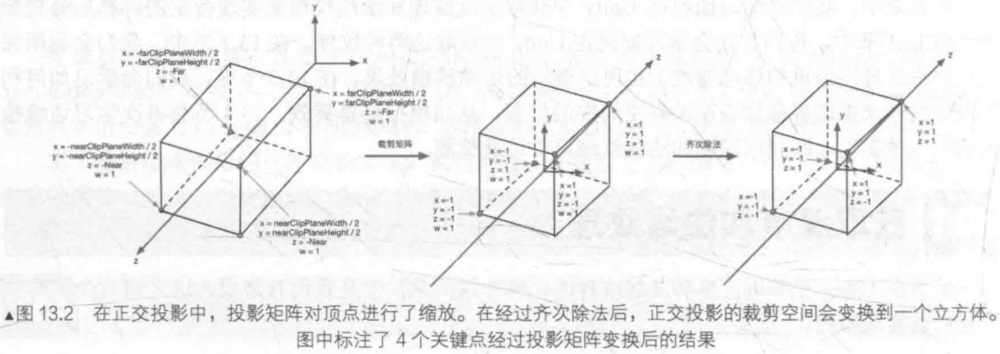

### 模版测试&深度测试

先模版测试，再深度测试

都通过，最终进行颜色混合
### DrawCall影响性能的原因

GPU一般是很快的渲染200或2000个三角形是没什么区别的，每次DrawCall之前CPU需要准备很多数据会花费大量时间<br>
一般通过增加单次提交的数据量减少DrawCall
### 表面着色器
Unity对顶点着色器与片元着色器的抽象，性能略差，但是使用方便，Unity处理了光照细节
### 点积与叉积
点积：计算夹角<br>
叉积：计算垂直向量
### 坐标系统

V(clip)=M(projection)⋅M(view)⋅M(model)⋅V(local)<br>
注意连乘的顺序<br>
M(model)⋅V(local) : 世间坐标<br>
M(view)⋅M(model)⋅V(local) : 观察坐标(以相机为原点的坐标)<br>
M(projection)⋅M(view)⋅M(model)⋅V(local) : 裁剪空间坐标(projection用于实现不同的相机效果，最终使相机内的可视空间变化为一个立方体方便裁剪)<br>

V(clip) 进行齐次除法(就是xyz/w)，所有位置都位于-1～1<br>
最终缩放x,y到屏幕比例进行渲染(变换到这里的z通常用于深度测试)
### 菲尼尔现象
站在水塘边看脚下是折射(可以看到鱼)，看远处是反射(可以看到蓝天)，折射与反射是并存的，有一定的比例关系
```glsl
// 取自天空盒折射反射案例
float ratio = 1.0 / 1.5;
vec3 I = vPos - uEyePos;
// 反射
vec3 R1 =  reflect(I,vNor);
vec4 V1 =  texture(uSkybox,R1);
// 折射
vec3 R2 = refract(I, vNor, ratio);
vec4 V2 = texture(uSkybox,R2);
// 菲尼尔现象 反射折射都存在  按比例分割
float rate = pow(dot(normalize(uEyePos-vPos),normalize(vNor)),5.0);
FragColor = V2*rate+V1*(1-rate);
```
### 广告牌技术
变换顶点使平面始终朝向相机
```glsl
layout (location = 0) in vec3 iPos;
layout (location = 1) in vec2 iTex;
uniform mat4 uModel;
uniform mat4 uView;
uniform mat4 uProjection;
uniform vec3 uEye;// 必须使用模型坐标系下的 位置 在外面转换好  里面不太方便求逆矩阵
out vec2 vTex;
void main()
{   // 把模型空间 (0,0,0) 当做原点
    vec3 center = vec3(0,0,0);
    // 计算 面朝相机为 z轴的坐标系
    vec3 zDir = normalize(uEye-center);
    vec3 xDir = normalize(cross(vec3(0,1,0),zDir));
    vec3 yDir = normalize(cross(zDir,xDir));
    // 转换顶点到对应的坐标空间 (原图片面朝z轴，转换后z轴朝向相机，图片朝向相机)
    vec3 pos = iPos.xyz-center;
    pos = xDir*pos.x+yDir*pos.y+zDir*pos.z;
    vTex = iTex;
    gl_Position = uProjection *uView * uModel * vec4(pos, 1.0);
}
```
```go
// 获取相机 在模型空间的位置
pos := m.eye.GetPos().Vec4(1)
model := m.obj.GetModel()
pos = model.Inv().Mul4x1(pos) // 外面求逆运算 更方便
temp := pos.Vec3()
m.shader.Set3fv("uEye", &temp[0])
```
### 物体如何转换到齐次空间


裁剪矩阵变化由不同的投影矩阵实现，最终片元着色器中gl_Position存储齐次空间下的坐标，传递到顶点着色器的过程会进行裁剪，最终齐次除法把数据归一到-1~1进行运算投影到屏幕
### glsl使用函数
函数的定义必须在使用前面，否则会报错，具体定义可以参考main方法，类型不支持自动转型，需要手动强转